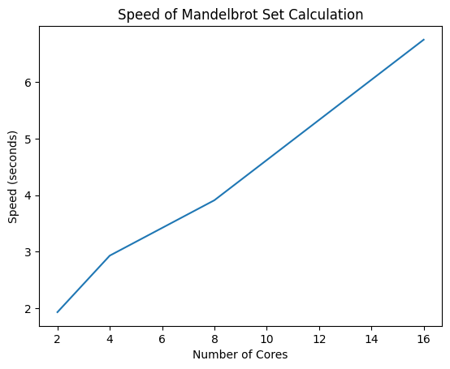

# CMU 15-418/618, Fall 2024

# Assignment 1

This is the starter code for Assignment 1 of CMU class 15-418/618, Fall 2024

Please review the course's policy on [academic
integrity](https://www.cs.cmu.edu/afs/cs/academic/class/15418-f24/www/academicintegrity.html),
regarding your obligation to keep your own solutions private from now
until eternity.


# prog1

## output message
```
++++                            (6.75x speedup from 16 threads)
++++                            (3.91x speedup from 8 threads)
++++                            (2.39x speedup from 4 threads)                         
++++                            (1.93x speedup from 2 threads)  

```



## conclusion
为了提高Mandelbrot集计算的速度，特别是在使用16个线程的情况下，我们可以采用一个简单的静态任务分配策略。这个策略的核心思想是将输出图像的行数均匀划分给每一个线程，这样每个线程处理的工作量将基本相等，从而最大化CPU的利用率。

改进的工作映射策略
均匀分配行数： 每个线程处理固定数量的图像行，而不是动态计算行数。这意味着将图像高度 height 除以线程数量 numThreads，并将相应的行分配给每个线程：

每个线程处理 height / numThreads 行。
最后一个线程处理剩余的行，以确保分配到的行数总和等于图像的总行数。
无需同步： 每个线程只需处理自己的行，不需要与其他线程进行通信或同步，这避免了线程之间的等待和管理开销，从而提高了并行效率

从4到8线程的扩展行为
在从4线程扩展到8线程时，由于线程数的翻倍，任务划分的效率可能会有明显提升，因此速度提升接近2倍，可能实现了更高的CPU利用率。

从8到16线程的扩展行为
然而，从8线程扩展到16线程时，速度提升的效率可能会有所下降。由于涉及到的线程数量增加，资源竞争、上下文切换等开销可能导致得益不如预期。因此，尽管我们仍可能接近8倍的加速比，但具体的加速效果可能不会呈现线性增长。

事实上还可以观察每个线程的表现来调整工作量（会注意到中间的线程其实工作的要慢一点），这样效率可以调整到7.多倍的速度。

# prog2

vector width values:2 Vector Utilization: 91.973816%

vector width values:4 Vector Utilization: 91.768977%

vector width values:8 Vector Utilization: 91.723633%

vector width values:16 Vector Utilization: 91.678284%

# prog3

## 结果分析
当threadCount设置为10时输出：
```
./mandelbrot_ispc --tasks
[mandelbrot serial]:            [142.255] ms
Wrote image file mandelbrot-serial.ppm
[mandelbrot ispc]:              [28.539] ms
Wrote image file mandelbrot-ispc.ppm
[mandelbrot multicore ispc]:    [6.371] ms
Wrote image file mandelbrot-task-ispc.ppm
                                (4.98x speedup from ISPC)
                                (22.33x speedup from task ISPC)
```
当threadCount设置为8时输出：
```
[mandelbrot serial]:            [142.275] ms
Wrote image file mandelbrot-serial.ppm
[mandelbrot ispc]:              [28.789] ms
Wrote image file mandelbrot-ispc.ppm
[mandelbrot multicore ispc]:    [7.426] ms
Wrote image file mandelbrot-task-ispc.ppm
                                (4.94x speedup from ISPC)
                                (19.16x speedup from task ISPC)
```
理论上应该8核的化线程数选为8最好,但实际上10更好？
几点可能的原因：
1. 线程和核心利用率
CPU 核心可用性：现代 CPU 通常有 8 个以上的核心，包括物理核心和逻辑核心（具有超线程）。例如，如果您的 CPU 有 10 个物理核心或 5 个具有超线程的核心（产生 10 个逻辑核心），则将 threadCount = 10 设置为可以比将其限制为 8 个线程更有效地利用所有可用资源。
超额订阅：当您设置 threadCount = 8 时，ISPC 任务可能无法充分利用所有可用的硬件线程，尤其是在具有超过 8 个逻辑核心的 CPU 上。这可能会导致一些 CPU 资源闲置。设置threadCount = 10 可使任务更均匀地在所有可用核心上分配工作负载，从而可能提高性能。
核心调度：操作系统的线程调度程序可能能够更有效地将 10 个任务分配到更多 CPU 核心上，从而比 8 个任务（这可能会导致一些资源利用不足）带来更好的性能。
2. 任务分配和负载平衡
任务粒度：当threadCount = 8 时，您可能会创建更大、更“粗粒度”的任务。这可能导致负载平衡效率降低，某些线程比其他线程执行的工作更多，从而导致某些线程利用不足（即某些线程更快完成任务并保持空闲状态）。
10 个任务的更细粒度：当threadCount = 10 时，任务划分更细。这种更细的粒度可能会改善负载平衡，因为任务更短，并且可以更频繁地为线程分配新工作，从而使它们在大部分执行时间内保持忙碌状态。
工作分配：通过将工作负载划分为 10 个任务，您可以在线程间实现更均匀的行分布，从而最大限度地减少空闲时间。工作负载分布中即使出现轻微不平衡也会导致线程等待其他线程完成，从而降低整体并行效率。
3. AVX2 矢量化和内存带宽
矢量化开销：虽然 ISPC 会生成 8 条宽的 AVX2 矢量指令，但矢量化性能取决于工作负载矢量化的效率。增加任务数量（从 8 个增加到 10 个）可能会提高缓存利用率或减少对内存带宽等资源的争用，尤其是在工作负载大小略有不匹配的情况下。
内存带宽：AVX2 指令会产生大量内存流量，因为每个矢量指令都会同时处理 8 个元素。通过使用 10 个线程而不是 8 个线程，可以优化内存访问模式（例如，更高效的缓存使用或更好的内存控制器利用率），从而提高吞吐量。
缓存争用：使用 10 个线程，工作负载可能会更好地分布在 CPU 缓存中，从而减少争用并提高数据局部性。如果只有 8 个线程，内存访问模式可能会导致更多的缓存冲突，从而降低性能。
4. 超线程和资源共享
超线程：如果您的 CPU 支持超线程，则设置 threadCount = 10 可能会启用逻辑内核和物理内核。超线程允许单个物理内核运行两个线程，从而提高可从同步多线程 (SMT) 中受益的工作负载的吞吐量。
线程重叠：超线程可以通过允许一个线程运行而另一个线程等待来自内存的数据来隐藏内存延迟。设置 threadCount = 10 可能会更好地利用物理内核和逻辑内核，通过允许线程重叠执行来提高整体性能。
5. 任务开销
任务开销最小：ISPC 任务系统在创建和管理任务时会产生一些开销。但是，将任务数从 8 增加到 10 不会显著增加这种开销，而且可能会提高整体 CPU 利用率。通过更好的负载平衡和资源利用率获得的性能抵消了额外的任务开销。
6. 共享资源争用
任务越多争用越少：如果线程数 = 8，则每个线程可能会遇到更多共享资源争用，如内存带宽或缓存行，从而导致性能下降。使用 10 个线程，工作负载可能会分布得更均匀，从而减少争用并允许每个线程更独立地运行，从而提高性能。

要注意rowsPerTask的表达式必须更正为(height + threadCount - 1) / threadCount;（上取整），不然按其分配规则可能有些行根本处理不到。

## extra questions:

### difference between pthread and ispc task system

pthread:
- 低级线程 API：Pthreads 是 POSIX 标准化的低级线程抽象，提供对线程创建、管理和同步的细粒度控制。
- 显式线程创建：每个线程都是一个独立的实体，具有自己的堆栈、寄存器和调度，由操作系统 (OS) 管理。
- 创建成本高昂：创建 Pthread 需要大量开销，因为操作系统必须分配内存等资源、为线程创建堆栈并管理其调度和上下文切换。
- 可扩展性有限：虽然现代操作系统调度程序效率很高，但创建和管理数千个线程会耗尽系统资源（例如 CPU、内存）并导致繁重的上下文切换开销，从而严重影响性能。
- 显式连接/同步：线程需要与其他线程显式连接，需要仔细管理以确保所有线程在继续之前完成其工作。

ispc task system:

- 高级任务并行性：ISPC 使用任务来抽象并行执行，任务是分布在线程中的较小工作单元，但由 ISPC 运行时管理，而不是直接由操作系统管理。

- 高效的资源使用：ISPC 中的任务不直接映射到操作系统线程。相反，ISPC 使用固定数量的工作线程，并将任务动态分配给这些工作线程。这减少了任务创建的开销，因为与线程相比，任务是轻量级的。

- 按 ISPC 运行时进行任务调度：ISPC 运行时在工作线程池上高效地调度任务。这允许创建大量任务而不会使系统不堪重负，因为 ISPC 在内部处理任务管理。

- 隐式任务并行性：使用 launch[] 启动任务，并由 sync 处理同步，这使得无需显式创建和加入线程即可轻松管理并行执行。


# prog4

## random initial value of x

- [sqrt serial]:          [675.835] ms
- [sqrt ispc]:            [130.613] ms
- [sqrt task ispc]:       [19.577] ms
                                (5.17x speedup from ISPC)
                                (39.67x speedup from task ISPC)
Build and run sqrt. Report the ISPC implementation speedup for single CPU core (no tasks) and when using all cores (with tasks). What is the speedup due to SIMD parallelization? What is the speedup due to multi-core parallelization?

Answer : I achieved 3.77x speedup from trivial ISPC and 98.67x speedup from 64 task ISPC. i.e. 3.77x speedup due to SIMD parallelization and 26.17x speedup due to multi-core parallelization.

Modify the contents of the array values to improve the relative speedup of the ISPC implementations. Construct a specifc input that maximizes speedup over the sequential version of the code and report the resulting speedup achieved (for both the with- and without-tasks ISPC implementations). Does your modification improve SIMD speedup? Does it improve multi-core speedup (i.e., the benefit of moving from ISPC without-tasks to ISPC with tasks)? Please explain why.

Answer : I construct an array with all the elements equal 2.998. Since all the elements are equal, each lane requires the same iteration, leads to no-mask in the SIMD parallelization. Also, 2.998 requires much more computation which will saturate the CPU and compensate for the multi-threading overhead in the task version. I achieved 5.58x speedup from ISPC and 144.70x speedup from task ISPC.

Construct a specific input for sqrt that minimizes speedup for ISPC (without-tasks) over the sequential version of the code. Describe this input, describe why you chose it, and report the resulting relative performance of the ISPC implementations. What is the reason for the loss in efficiency? (keep in mind we are using the --target=avx2 option for ISPC, which generates 8-wide SIMD instructions).

Answer : I construct an array with all the elements equal 1 except for those whose index is multiples of 8 which equal 2.998. For this input, I achieve 0.78x speedup from ISPC, which is worse than the serial case.

# prog5

## answer1:

只取得了(1.19x speedup from use of tasks)的加速效果

由于设计大规模数组运算->内存受限运算

-每次处理器处理数据时必须等待极长的内存访问时间，导致处理器利用率低下，从而降低了性能。通过并行计算并不改变决速步

## answer2：

When the program writes to one element of result, it will first fetch the cache line which contains this element into the cache. This requires one memory operation. Then when this cache line is not needed, it will be flashed out of the cache, this requires another memory operation.

## answer4:

也是上面内存受限运算的解决方案：减少数据访问规模

优化：

SMID操作：使用了_m128类型和相关的指令来处理4个浮点数，提高性能

非临时储存（non-temporal memory）：通过指令将数据直接写入内存，（本来这里也不需要缓存）避免了缓存的影响，提高性能

_mm_load_ps/_mm_store_ps：直接从内存加载/写入4个浮点数，避免了缓存的影响，提高性能 _mm_stream_ps：将数据直接写入内存，不用等待缓存，提高性能
